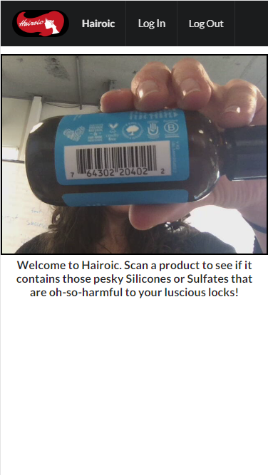
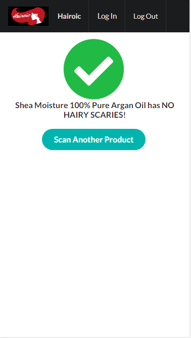
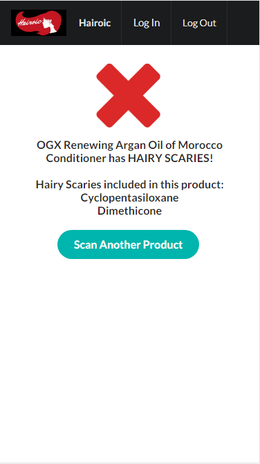
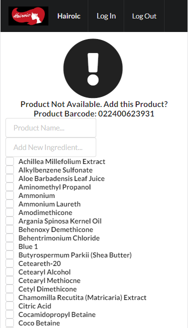

# * Hairoic *

This is my Back-End Capstone for Nashville Software School.

# Tools:

- [x] React
- [x] Semantic UI React
- [x] Javascript 
- [x] C#
- [x] .Net Core

Fork and Clone repository

run:
### `npm install`
inside of root repository.

run:
### `start hairoic.sln`
inside of root repository to acess the database.
Press Run to start API

run:
### `npm start`
inside of src file

Make sure you allow camera access.
You can scan any product to see if there are Silicones or Sulfates in the said product.

If the scanned product is free of Silicones and Sulfates, this will appear.

If the scanned product has Silicones and Sulfates, it will tell you what ingredients are harmful.

If the product is not in the database, feel free to add it, you must me logged in to do so.
